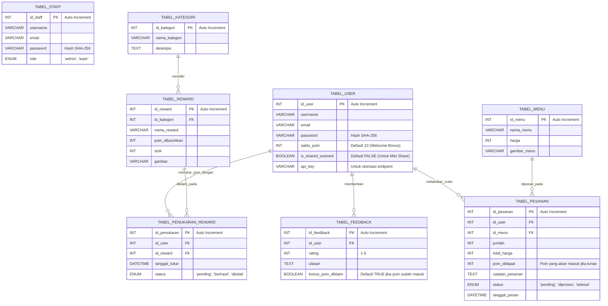

# FINAL Entity Relationship Diagram (ERD) - Revisi Mock POS

**Proyek:** Program Loyalti / Membership Ngolab Express Cafe **Fokus Revisi:** Penggantian tabel kode struk menjadi tabel `TABEL_PESANAN` untuk mengakomodasi fitur Self-Order dan injeksi poin otomatis.

## 1. Skema Relasi Antar Tabel

## 2. Penjelasan Perubahan Logika (Self-Order)

1. **TABEL_PESANAN (Menggantikan Kode Struk):** Sistem bergeser menjadi _seamless_. Konsumen memilih menu -> pesan -> masuk database.

2. **Pencairan Poin (Trigger):** Poin **tidak langsung bertambah** saat pesanan dibuat (karena bisa saja di-cancel). Poin bertambah ketika Admin di halaman Dashboard melakukan _Update Status_ pada `TABEL_PESANAN` dari `'pending'` menjadi `'selesai'`.

3. **Kolom Baru Misi Sosial Media:** Pada `TABEL_USER`, ditambahkan `is_shared_sosmed`. Frontend cukup memanggil API `/api/share-bonus`, lalu backend memvalidasi dan mengubah _boolean_ ini menjadi `true` sambil menyuntikkan tambahan saldo poin.

4. **Relasi Menu & Pesanan:** Relasi ini membuat fungsionalitas web semakin kaya karena tabel menu (yang diinput oleh anggota 4) kini saling terikat dengan tabel pesanan (yang dikelola anggota 3).
